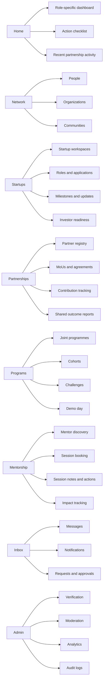
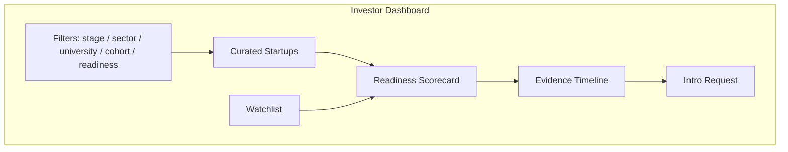
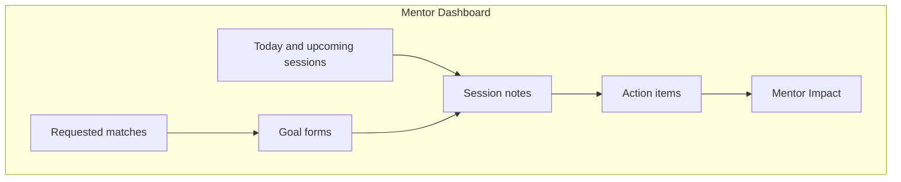
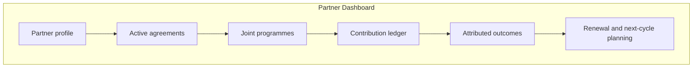
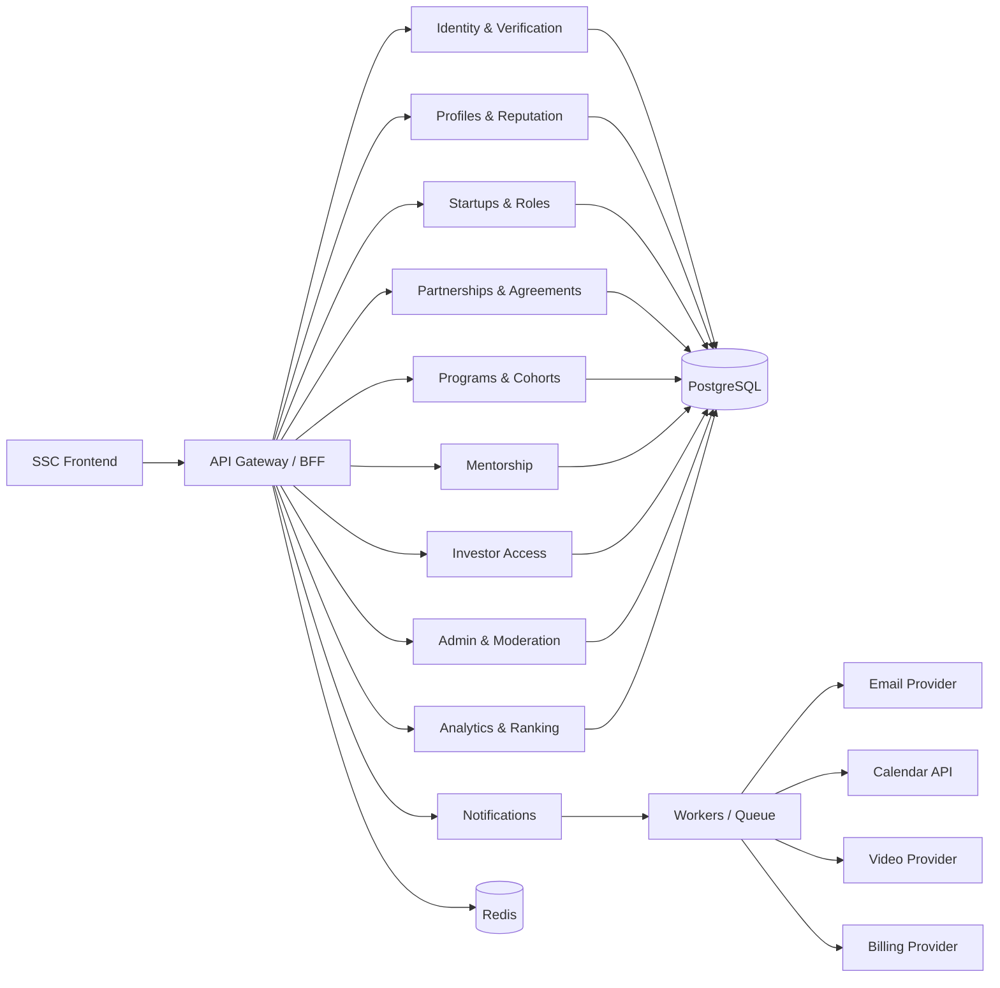

# QS-Ready Partnership-First SSC Transformation Report

## Executive Summary

SSC already has the right strategic thesis for a serious education-innovation product: it is not trying to be just another student social feed, but a trust-based execution system for verified student founders, mentors, investors, and university operators. The strongest parts of the existing concept are its emphasis on verified identity, visible work, startup team formation, mentor support, investor-facing signals, and university reporting. The user-provided SSC research report already frames the product as a “verified student founder operating system,” recommends a modular monolith, identifies “Monthly Activated Builders” as the right north-star direction, and argues that trust infrastructure—not only engagement features—must sit at the core of the product. fileciteturn0file0

For QS Reimagine Education 2026, however, the selected category is not judging “general startup platform quality.” It is judging whether the **partnership itself** is the primary engine of innovation, scale, and measurable educational impact. The official QS category page is explicit that *The Power of Partnerships* recognizes projects where strategic collaboration is the main driver of educational innovation and scale, not merely a supporting element. QS also accepts early-stage initiatives, prototypes, and recently launched projects, but asks applicants to provide supporting evidence where available, such as pilot data, feasibility studies, testing results, or implementation plans. citeturn0search0turn0search3

That distinction changes the transformation target. SSC should **not** be positioned for this submission as a student startup platform with several types of users. It should be redesigned and narrated as a **Partnership Operating System**: a product that lets universities, student communities, mentors, companies, incubators, sponsors, and investors jointly run programs, track contributions, and produce attributable outcomes that no single actor could create alone. This is the single most important product and storytelling change required to become final-capable in this category. The existing SSC report supports this direction because it already recommends strong program operations, cohorting, mentor workflows, analytics instrumentation, and university-facing controls. fileciteturn0file0

The most important gap is not visual design. The user has specified that the existing visual language—backgrounds, transparency, glassmorphism, and overall look and feel—must remain. That constraint is workable. QS is not judging the product on whether it has been aesthetically reinvented; it is judging whether the product’s **information architecture, role-specific dashboards, partnership data model, measurable outcomes, and sustainability model** are coherent, credible, and evidentially strong. Therefore, the recommended work is a **layout, hierarchy, and systems redesign**, not a visual rebrand. This is fully consistent with the existing SSC report, which emphasizes information architecture, progressive disclosure, role-aware flows, accessibility, analytics-first instrumentation, and operator dashboards as value drivers. fileciteturn0file0

Past and recent Power of Partnerships examples reinforce the same point. The University of Exeter’s 2024 Gold-winning Centre for Degree Partnerships was recognized for degree apprenticeship delivery built with more than 400 employer partners; EdUHK’s Bronze-winning CEHETLI project explicitly involved six Cambodian universities, the Directorate General of Higher Education, and the World Bank; QS’s own category wording highlights partnership-led innovation rather than stand-alone product novelty. Those are not “networking apps.” They are structured, multi-party, outcome-generating partnership systems. SSC can become competitive in that direction, but only if the product is reoriented from multi-user community software into auditable, multi-party program infrastructure. citeturn21search0turn21search1turn21search4turn0search0

The practical conclusion is clear. SSC should pursue a **partnership-first MVP-plus** submission built around five mandatory additions: a partner registry, a formal joint-program module, role-specific dashboards for mentors/investors/partners/program managers, contribution and outcome attribution, and a reputation/ranking layer based on verified evidence rather than social popularity. If those changes are delivered, documented, and used in a short pilot with real partners, SSC can become a credible shortlist candidate in this category. If they are not delivered, the project is likely to look like a strong concept with weak category fit. citeturn0search0turn0search3

## Current State and Repo Audit

The user-provided SSC platform report gives a strong foundation. It defines the core user groups—student founders, student builders, mentors, investors/sponsors/alumni judges, and university administrators—and it proposes information architecture, mentorship flow, investor view, moderation, analytics, monetization, and a modular-monolith technical direction. It also recommends that the product be evaluated by activation, collaboration, mentorship quality, and institutional value, rather than vanity metrics such as signups or impressions. This is a materially strong product thesis for an early-stage system. fileciteturn0file0

At the same time, the same report is candid about the present stage: the frontend is described as partially built, while repository specifics, design system status, and API contracts were initially unspecified, and the fastest next step was identified as a frontend/backend audit. The report also centers startup identity, execution visibility, mentorship, and admin tooling—strong assets for SSC in general—but it does **not** yet establish a live partnership operating layer as the dominant product story. That distinction matters because the QS category is evaluating the architecture and outcomes of partnership itself. fileciteturn0file0

A rigorous working audit of the public repo, based on prior session observation that should be revalidated against the live repository before implementation, points to the following state:

| Area | Working audit finding | QS implication |
|---|---|---|
| Frontend maturity | Frontend prototype is materially beyond a wireframe, but still demo-oriented and not yet institutional-grade | Good for early-stage eligibility, weak for final-level proof |
| Data realism | Demo data appears to be present; seeded counts and sample ecosystem numbers cannot be used as impact evidence | Dangerous unless clearly labeled as illustrative |
| Role coverage | Student/community/startup views exist conceptually, but partnership-specific entities and screens are underdeveloped | Category fit remains partial |
| Trust infrastructure | Verification, trust registry, and evidence depth appear incomplete | Weakens credibility for judges |
| Backend readiness | Backend plan exists conceptually, but partnership-first entities and flows are not yet modeled deeply enough | Major blocker for pilot measurement |
| Operations | Admin/operator needs are recognized, but partnership governance and contribution attribution are not first-class | Main gap against category criteria |

This interpretation is consistent with the SSC report’s own diagnosis: the product already needs strong program ops, verification, mentor quality control, analytics, and reporting to become institution-ready rather than merely student-friendly. fileciteturn0file0

The public-repo working observations that matter most for the QS submission are these. The frontend appears demo-capable but still prototype-centric; some key role screens are present, but partner organizations, partnership agreements, joint programs, contribution tracking, and attributable outcomes are not yet modeled as first-class system objects; demo values risk being confused with live traction if they are shown in the application video; and the known frontend gaps previously observed in this conversation—especially around verification, trust, mentor completeness, admin robustness, and investor evidence views—map directly to the exact areas that judges in this category will scrutinize most heavily. These points should be treated as **revalidation-required engineering observations** before development proceeds.

The more important issue is conceptual. The current product story is still stronger as a **student founder operating system** than as a **partnership operating system**. That is not a criticism of the concept. It is simply a category-fit diagnosis. The existing SSC report places the most energy on user journeys, startup pages, role boards, mentors, investors, and admin operations—which is right for a founder product—but the partnership layer is still mostly implicit. For QS Power of Partnerships, it must become explicit, measurable, and persistent in both the product and the narrative. fileciteturn0file0

A useful comparison with best-in-class benchmarks makes the gap clearer.

| Benchmark | What it proves | What SSC should borrow | What SSC should not copy |
|---|---|---|---|
| Y Combinator Co-Founder Matching / Startup School | Structured founder discovery works when matching is intentional, profile-based, and gated to serious participants | Goal-based onboarding, compatibility signals, structured trial matching, seriousness filters | YC is not partnership infrastructure; it is founder matching and education content citeturn6search3turn6search5 |
| Wellfound | Startup hiring works when roles, candidate signals, and direct applications are clean and searchable | Fast role application flows, skill-based discovery, startup-side hiring simplicity | It is fundamentally a hiring marketplace, not a multi-party educational partnership system citeturn6search2turn6search6 |
| Gust | Startup/investor/accelerator workflows require structured deal flow, applications, and operator tooling | Investor watchlists, accelerator/program tooling, benchmark/administrative rigor | Gust feels transactional; SSC must retain community and educational value, not only funding workflows citeturn6search0turn6search1 |
| StartX | Founder communities create durable value when mentorship, investor access, partners, and community are organized around trusted membership | Mentor network curation, investor network, partner categories, no-equity founder-first ecosystem design | Eligibility and brand exclusivity model cannot be copied wholesale; SSC needs wider university portability citeturn8search0turn8search5turn8search7turn8search11 |
| MIT delta v | University accelerators win through strong cohorts, mentors, perks/partners, and measurable venture progress | Cohort operations, partner network visibility, demo-day evidence, structured acceleration | SSC should not become a single accelerator program; it should become the infrastructure behind many such programs citeturn7search1turn7search8 |

The takeaway from this benchmark set is that SSC’s **core competitive opportunity** is not to out-social LinkedIn, out-hiring-marketplace Wellfound, or out-accelerator StartX. It is to combine the strongest primitives of those systems into a university- and partner-ready operating layer that can run joint programs, record verified contributions, and produce exportable evidence for partners, sponsors, mentors, and judges. The SSC report explicitly points in that direction through its emphasis on execution visibility, institutional reporting, and trust signals. fileciteturn0file0

## Target Product for QS Power of Partnerships

To become category-fit, SSC’s product message should be reframed as follows:

> **SSC is a partnership operating system for student entrepreneurship. It enables universities, student communities, mentors, companies, accelerators, sponsors, and investors to jointly design programs, allocate contributions, support startup teams, and measure attributable outcomes through one verified digital infrastructure.**

That is the phrasing direction the application should take. It is much closer to what QS is rewarding in this category than “student startup social platform.” The official category definition explicitly centers strategic collaboration as the primary driver of innovation, scale, and impact. citeturn0search0turn0search2

### Menu and information architecture

The current visual style should remain, but the information architecture should be simplified and made more legible. The top-level navigation should move from a crowded ecosystem feel to a partnership-first operational hierarchy:

| Current design pressure | Recommended top-level replacement |
|---|---|
| Too many parallel discovery surfaces | **Home** |
| Mixed user/entity navigation | **Network** |
| Startup building core | **Startups** |
| Partnership story hidden in admin/programs | **Partnerships** |
| Programs/events/sprints/accelerators split conceptually | **Programs** |
| Mentorship treated as a side module | **Mentorship** |
| Messaging and notifications fragmented | **Inbox** |
| Rankings exposed too prominently | Move under profile/dashboard as **Reputation Center** |
| Heavy admin clutter | **Admin** role-gated only |

This aligns with the existing SSC report’s recommendation to organize around Home, Network, Startups, Mentorship, Programs, and Admin, but extends it by elevating **Partnerships** to a top-level domain because SSC’s chosen QS category requires that layer to be visible and central. fileciteturn0file0

A hierarchy diagram for the target product is below.



### Role-based dashboards

SSC should keep one visual system but deliver different information density and action hierarchy for different roles. This is consistent with the existing report’s emphasis on progressive disclosure and operator-grade experiences. fileciteturn0file0

The required dashboards are:

| Dashboard | First screen should answer | Must contain |
|---|---|---|
| Student/Founder | “What should I do next?” | profile progress, startup tasks, role recommendations, current program milestones, mentor actions |
| Mentor | “Who needs my help, what is scheduled, and what changed?” | session queue, mentee summaries, goal sheets, notes, outcomes, impact score |
| Investor | “Which teams are genuinely becoming investable?” | curated deal flow, watchlist, readiness scorecards, milestone history, partner-backed evidence |
| University/Partner | “What value did our organization create and receive?” | active joint programs, cohorts, students reached, mentor hours, challenge outcomes, attribution |
| Program Manager | “Which cohort/program is healthy or at risk?” | funnel metrics, attendance, completion, mentor coverage, alerts, exports |
| Platform Admin | “Where is trust breaking and what needs intervention?” | verification queues, abuse reports, incomplete evidence, suspicious scoring, audit trails |

Three example wireflows are below.







### Mandatory new product modules

The current concept will not be sufficient for the category unless the following modules are added as first-class product objects.

#### Partner registry

This must be a real system object, not a static directory. Each partner organization should have:

- organization type: university, student society, company, accelerator, sponsor, investor network, NGO, public body
- verification state
- named contacts
- partnership status
- areas of contribution
- active programs
- signed documents
- outcomes and contribution history
- approval and renewal states

This is the digital spine of the category fit. Without it, SSC remains multi-user product software, not partnership infrastructure.

#### Partnership agreements and MoU layer

SSC needs a productized **agreement object**, not only an uploaded PDF. The system should record:

- agreement type
- parties
- start/end dates
- intended outcomes
- resource commitments
- data-sharing terms
- branding/use terms
- program scope
- renewal/review dates
- current execution status

The uploaded report already stresses privacy-by-design, auditability, and institutional workflows; this module turns that strategy into partnership evidence. fileciteturn0file0

#### Joint-program module

This is the single highest-priority functional change. A “joint program” should allow multiple partners to co-run a structured initiative such as:

- cross-university founder sprint
- company challenge program
- mentor office-hours series
- demo day or showcase
- incubator-prep cohort
- themed accelerator track

Each joint program should include program owner, partners, partner roles, cohorts, mentor pool, eligibility rules, challenges, milestones, evaluation rubrics, outcome measures, and exportable reporting.

#### Partnership contribution tracking

This is what will make SSC differentiated and defensible. The system must be able to show that a result was enabled by specific partner contributions. Contribution objects should cover:

- student seats supplied
- mentors supplied
- challenge briefs supplied
- meetings hosted
- sponsorship funds
- credits or perks
- pilot opportunities
- judges and reviewers
- event space and marketing support

#### Evidence and outcome package

Every program and startup should be able to generate an evidence timeline showing partner-linked progress over time. This is what investors, universities, and QS judges will find persuasive—because it moves the product away from static profiles and toward longitudinal evidence. The SSC report explicitly argues that visible execution and inspectable progress are central to the product thesis. fileciteturn0file0

## Architecture, Data Model, and APIs

The backend should follow the modular-monolith direction already recommended in the SSC report: one relational source of truth, clearly separated modules, analytics-first instrumentation, and strong privacy/security controls from the start. That recommendation is technically sound for SSC’s development stage and is more credible for QS than prematurely fragmented microservices. fileciteturn0file0

### Recommended modular architecture

The fastest and most coherent backend architecture for SSC, while preserving current frontend work, is:

- **Frontend:** keep current React/Vite-style frontend and visual system unchanged; refactor navigation, role layouts, and dashboard components only
- **Backend API:** TypeScript modular monolith; if the existing engineering direction already considered Bun/Hono/Drizzle, that is acceptable and consistent with fast execution
- **Primary store:** PostgreSQL
- **Cache/queues:** Redis
- **Object storage:** S3-compatible or Cloud Storage
- **Auth:** passwordless email + OAuth + passkeys/WebAuthn for privileged roles
- **Video:** Daily or equivalent for embedded sessions
- **Calendar:** Google Calendar integration
- **Email + reminders:** SendGrid or equivalent
- **Billing:** Stripe Billing
- **Hosting:** Vercel for frontend previews plus Cloud Run or an equivalent managed container platform for backend APIs and workers

These technology choices are supported by the SSC report’s earlier technical recommendations and align with official platform documentation: PostgreSQL recommends `jsonb` for most applications that need structured JSON; GitHub recommends GitHub Apps over OAuth apps for finer permissions and short-lived tokens; Google Calendar exposes a RESTful API for events and ACLs; Daily supports API-created rooms and embedded experiences; Vercel preview deployments support fast QA/collaboration; Cloud Run provides managed container-based execution without cluster management. fileciteturn0file0 citeturn12search1turn16search4turn18search0turn18search5turn16search1turn17search0

A high-level service design is below.



### Canonical entity model

The current SSC data model must be extended so that **organizations and agreements** become top-tier entities.

```mermaid
erDiagram
    USERS ||--o{ USER_ROLES : has
    USERS ||--o{ ORG_MEMBERSHIPS : belongs_to
    ORGANIZATIONS ||--o{ ORG_MEMBERSHIPS : has
    ORGANIZATIONS ||--o{ PARTNERSHIP_AGREEMENTS : signs
    PARTNERSHIP_AGREEMENTS ||--o{ AGREEMENT_PARTIES : includes
    ORGANIZATIONS ||--o{ AGREEMENT_PARTIES : participates_in

    ORGANIZATIONS ||--o{ PROGRAM_PARTNERS : contributes_to
    PROGRAMS ||--o{ PROGRAM_PARTNERS : has
    PROGRAMS ||--o{ COHORTS : contains
    COHORTS ||--o{ COHORT_PARTICIPANTS : includes
    USERS ||--o{ COHORT_PARTICIPANTS : joins
    STARTUPS ||--o{ COHORT_PARTICIPANTS : joins_as_team

    USERS ||--o{ VERIFICATIONS : receives
    USERS ||--o{ CONSENT_RECORDS : grants
    STARTUPS ||--o{ STARTUP_MEMBERS : has
    USERS ||--o{ STARTUP_MEMBERS : joins
    STARTUPS ||--o{ STARTUP_ROLES : posts
    USERS ||--o{ STARTUP_ROLE_APPLICATIONS : submits
    STARTUP_ROLES ||--o{ STARTUP_ROLE_APPLICATIONS : receives

    USERS ||--o{ MENTOR_PROFILES : may_have
    MENTOR_PROFILES ||--o{ MENTOR_SESSIONS : hosts
    USERS ||--o{ MENTOR_SESSIONS : attends
    STARTUPS ||--o{ MENTOR_SESSIONS : relates_to
    MENTOR_SESSIONS ||--o{ SESSION_ACTION_ITEMS : produces
    MENTOR_SESSIONS ||--o{ MENTOR_FEEDBACK : receives

    USERS ||--o{ INVESTOR_PROFILES : may_have
    INVESTOR_PROFILES ||--o{ WATCHLISTS : owns
    WATCHLISTS ||--o{ WATCHLIST_ITEMS : contains
    STARTUPS ||--o{ WATCHLIST_ITEMS : tracked_in
    INVESTOR_PROFILES ||--o{ INTRO_REQUESTS : creates
    STARTUPS ||--o{ INTRO_REQUESTS : receives

    ORGANIZATIONS ||--o{ PARTNER_CONTRIBUTIONS : provides
    PROGRAMS ||--o{ PARTNER_CONTRIBUTIONS : uses
    STARTUPS ||--o{ STARTUP_UPDATES : publishes
    STARTUPS ||--o{ TASKS : contains
    USERS ||--o{ TASK_EVIDENCE : submits

    USERS ||--o{ AUDIT_LOGS : triggers
    ORGANIZATIONS ||--o{ OUTCOME_RECORDS : influences
    PROGRAMS ||--o{ OUTCOME_RECORDS : generates
    STARTUPS ||--o{ OUTCOME_RECORDS : achieves
    USERS ||--o{ SCORE_EVENTS : accumulates
    ORGANIZATIONS ||--o{ SCORE_EVENTS : accumulates
    USERS ||--o{ RANKING_SNAPSHOTS : appears_in
    ORGANIZATIONS ||--o{ RANKING_SNAPSHOTS : appears_in
```



### PostgreSQL schema recommendation

The full architecture markdown should contain the whole schema, but the most important tables are below.

```sql
create table organizations (
  id uuid primary key,
  type text not null check (type in ('university','student_community','company','accelerator','sponsor','investor_network','ngo','public_body')),
  legal_name text not null,
  display_name text not null,
  slug text unique not null,
  verification_status text not null default 'pending',
  country_code char(2),
  website_url text,
  created_at timestamptz not null default now()
);

create table partnership_agreements (
  id uuid primary key,
  agreement_type text not null check (agreement_type in ('mou','sponsorship','challenge','mentor_network','data_sharing','pilot')),
  title text not null,
  status text not null check (status in ('draft','pending_signature','active','expired','terminated')),
  starts_at date,
  ends_at date,
  intended_outcomes jsonb not null default '[]'::jsonb,
  data_terms jsonb not null default '{}'::jsonb,
  signed_document_url text,
  created_by uuid not null references users(id),
  created_at timestamptz not null default now()
);

create table agreement_parties (
  id uuid primary key,
  partnership_agreement_id uuid not null references partnership_agreements(id) on delete cascade,
  organization_id uuid not null references organizations(id) on delete cascade,
  role text not null,
  responsibility_summary text,
  unique (partnership_agreement_id, organization_id)
);

create table programs (
  id uuid primary key,
  name text not null,
  program_type text not null check (program_type in ('accelerator','challenge','sprint','demo_day','mentor_series','incubator_prep')),
  status text not null check (status in ('draft','open','active','completed','archived')),
  host_organization_id uuid references organizations(id),
  description text,
  outcomes_framework jsonb not null default '{}'::jsonb,
  created_at timestamptz not null default now()
);

create table program_partners (
  id uuid primary key,
  program_id uuid not null references programs(id) on delete cascade,
  organization_id uuid not null references organizations(id) on delete cascade,
  partner_role text not null check (partner_role in ('host','delivery','mentor','challenge_owner','sponsor','judge','investor_access','community')),
  contribution_commitment jsonb not null default '{}'::jsonb,
  unique (program_id, organization_id, partner_role)
);

create table partner_contributions (
  id uuid primary key,
  program_id uuid not null references programs(id) on delete cascade,
  organization_id uuid not null references organizations(id) on delete cascade,
  contribution_type text not null check (contribution_type in ('mentors','students','challenge','funding','credits','space','judging','pilot_access','marketing')),
  quantity numeric,
  unit text,
  evidence_url text,
  verified_by uuid references users(id),
  verified_at timestamptz
);

create table outcome_records (
  id uuid primary key,
  program_id uuid references programs(id),
  startup_id uuid references startups(id),
  outcome_type text not null check (outcome_type in ('team_formed','mvp_completed','mentor_session_completed','pilot_introduction','internship','investment_meeting','award_submission','demo_day_completion')),
  attribution_mode text not null check (attribution_mode in ('direct','shared','influenced')),
  primary_partner_id uuid references organizations(id),
  supporting_partner_ids jsonb not null default '[]'::jsonb,
  confidence_score numeric not null default 0.5,
  evidence jsonb not null default '{}'::jsonb,
  achieved_at timestamptz not null default now()
);
```

PostgreSQL’s `jsonb` support makes this design practical because SSC needs both structured relational integrity and flexible metadata for institution-specific rules, evidence, and outcomes. PostgreSQL documentation explicitly recommends `jsonb` for most such use cases. citeturn16search4turn16search5

### API design and contracts

The API must be organized around business capabilities, not pages.

| Domain | Example endpoints |
|---|---|
| Identity & verification | `POST /auth/magic-link`, `POST /auth/passkey/register`, `POST /verifications` |
| Organizations & partnerships | `GET /organizations`, `POST /organizations`, `POST /agreements`, `POST /programs/{id}/partners` |
| Programs & cohorts | `POST /programs`, `POST /cohorts`, `POST /cohorts/{id}/participants` |
| Startups & work | `POST /startups`, `POST /startup-roles`, `POST /tasks`, `POST /updates` |
| Mentorship | `GET /mentors`, `POST /mentor-sessions`, `POST /mentor-sessions/{id}/notes` |
| Investor access | `GET /startups/discovery`, `POST /watchlists`, `POST /intro-requests` |
| Reputation & ranking | `GET /scores/{entity}`, `POST /score-events/recompute`, `GET /rankings` |
| Admin & moderation | `GET /queues/verification`, `POST /moderation/actions`, `GET /audit-logs` |
| Analytics | `POST /events`, `GET /reports/program/{id}`, `GET /reports/partner/{id}` |

Representative contract examples follow.

```json
POST /api/programs
{
  "name": "Cross-Campus Founder Sprint",
  "programType": "sprint",
  "hostOrganizationId": "org_utu_01",
  "description": "A 10-week founder sprint jointly delivered by two universities and a corporate partner.",
  "outcomesFramework": {
    "primary": ["team_formed", "mentor_session_completed", "mvp_completed"],
    "secondary": ["pilot_introduction", "demo_day_completion"]
  }
}
```

```json
201 Created
{
  "id": "prg_01",
  "status": "draft",
  "programType": "sprint",
  "createdAt": "2026-07-23T12:00:00Z"
}
```

```json
POST /api/programs/prg_01/partners
{
  "organizationId": "org_company_02",
  "partnerRole": "challenge_owner",
  "contributionCommitment": {
    "challengeBriefs": 2,
    "mentorHours": 20,
    "judges": 2
  }
}
```

```json
POST /api/mentor-sessions
{
  "mentorProfileId": "mnt_11",
  "startupId": "stp_71",
  "programId": "prg_01",
  "startsAt": "2026-09-10T14:00:00Z",
  "mode": "video",
  "goalSheet": {
    "sessionGoal": "Validate customer interview plan",
    "requestedHelp": ["question framing", "partner intro readiness"]
  }
}
```

```json
POST /api/outcome-records
{
  "programId": "prg_01",
  "startupId": "stp_71",
  "outcomeType": "pilot_introduction",
  "attributionMode": "shared",
  "primaryPartnerId": "org_company_02",
  "supportingPartnerIds": ["org_university_01", "org_accelerator_03"],
  "confidenceScore": 0.82,
  "evidence": {
    "meetingDate": "2026-10-01",
    "notesUrl": "https://...",
    "introducedByUserId": "usr_12"
  }
}
```

### RBAC matrix

SSC must be tenant-aware and multi-role because one person may be a founder, mentor, judge, or operator at different times. The existing SSC report already recommends RBAC and multi-role support. fileciteturn0file0

| Action | Student | Mentor | Investor | Partner Admin | Program Manager | Platform Admin |
|---|---:|---:|---:|---:|---:|---:|
| View public startup pages | ✓ | ✓ | ✓ | ✓ | ✓ | ✓ |
| Create/edit startup | ✓ |  |  |  | with delegation | ✓ |
| Apply to role | ✓ |  |  |  |  | ✓ |
| Create mentor availability |  | ✓ |  |  |  | ✓ |
| Book mentor session | ✓ | ✓ accept |  |  | ✓ | ✓ |
| Create watchlist |  |  | ✓ |  |  | ✓ |
| Request intro | founder only |  | ✓ |  | with permission | ✓ |
| Create partner organization |  |  |  | ✓ limited | ✓ | ✓ |
| Upload/sign agreement |  |  |  | ✓ | ✓ | ✓ |
| Create joint program |  |  |  | with scope | ✓ | ✓ |
| Verify users |  |  |  |  | ✓ scoped | ✓ global |
| Moderate content |  |  |  |  | ✓ scoped | ✓ global |
| View audit logs |  |  |  | limited own org | limited tenant | ✓ |
| Recompute rankings |  |  |  |  |  | ✓ |

### Event, webhook, and analytics taxonomy

SSC should follow the spirit of GA4’s recommended-and-custom event model: a stable taxonomy with controlled names and properties, not ad hoc event sprawl. Google’s documentation explicitly encourages recommended plus custom events for richer reporting. The existing SSC report already proposes a solid event taxonomy; that recommendation should be retained and extended for partnership attribution. fileciteturn0file0 citeturn13search2turn13search3

The minimum analytics event families are:

- `auth.*` — sign_up_started, login_completed, verification_submitted
- `profile.*` — profile_completed, role_selected
- `startup.*` — startup_created, role_posted, role_applied, update_published
- `mentor.*` — mentor_matched, session_booked, session_completed, actionitem_closed
- `program.*` — application_started, application_submitted, cohort_joined, challenge_completed
- `partner.*` — partner_added, agreement_signed, contribution_verified
- `investor.*` — watch_added, intro_requested, intro_accepted
- `reputation.*` — peer_eval_submitted, mentor_feedback_submitted, score_recomputed
- `admin.*` — moderation_action, verification_approved, audit_exported
- `outcome.*` — outcome_recorded, outcome_verified, attribution_adjusted

Webhooks should exist for high-value external events only: email delivery/engagement, calendar sync changes, video-room completion, billing state changes, and optionally signed GitHub or LinkedIn contribution imports. SendGrid’s Event Webhook documentation is especially relevant because it supports near-real-time delivery/engagement events but explicitly warns against placing PII in categories/unique arguments fields. citeturn18search1turn18search2turn18search3

## Ranking, Analytics, and Evidence

The ranking system must not be a gamified leaderboard. If SSC exposes rankings naively, it will create noise, vanity behavior, and manipulation risk. The correct design principle is: **rank verified contribution and partnership-enabled progress, not popularity.** This is consistent with the SSC report’s emphasis on trust, contribution logs, peer evaluation, mentor ratings, and visible execution evidence. fileciteturn0file0

### Score families

SSC should maintain separate score families rather than a single opaque point total.

| Score | Entity | Purpose |
|---|---|---|
| Builder Contribution Score | user | Measure verified individual contribution to startup work |
| Startup Execution Score | startup | Measure how consistently a team is turning effort into evidence |
| Mentor Impact Score | mentor | Measure whether mentoring leads to completed actions and better outcomes |
| Partner Impact Score | organization | Measure tangible contribution and attributable educational value |
| Investor Readiness Score | startup | Summarize investability signals without pretending to predict funding |
| Program Health Score | cohort/program | Help operators identify strong and at-risk cohorts |

### Recommended scoring logic

The rules below are design recommendations, not external requirements.

**Builder Contribution Score** should be driven primarily by accepted tasks, milestone ownership, documented updates, verified attendance, and structured peer/mentor validation. Suggested weighting:

- 35% verified work evidence
- 20% quality-adjusted peer evaluation
- 20% mentor validation
- 15% consistency over time
- 10% integrity signals

**Startup Execution Score** should focus on evidence density, milestone completion, team completeness, update cadence, responsiveness, and partner-program participation.

**Mentor Impact Score** should be built from session completion, attendance quality, action-item completion after sessions, mentee satisfaction, and outcome uplift.

**Partner Impact Score** should reward fulfilled commitments and attributable outcomes, not branding presence alone. A partner that supplies one logo and zero mentors should not rank above a university or company that supplied challenge briefs, mentors, office hours, and confirmed pilot conversations.

### Anti-gaming rules

Reputation-system research is clear that platform reputation can be biased, externally distorted, and vulnerable to low-quality feedback loops. Stack Overflow’s own reputation design uses daily limits, privilege thresholds, and anti-targeting logic; it also explicitly warns against voting for people rather than quality and reverses suspicious voting patterns. Research on marketplace reputation systems likewise shows that platforms need mechanisms that identify quality rather than merely accumulating noisy feedback. citeturn9search1turn9search2turn9search5turn9search7

SSC should therefore implement the following controls:

- no score impact from unverified users
- no self-rating, self-confirmation, or same-team reciprocal boosting beyond strict limits
- daily scoring caps per counterparty and per entity
- stronger weight for evidence-bearing actions than for likes or follows
- low-weight or zero-weight for purely social engagement
- anomaly detection for repeated reciprocal scoring pairs
- cooldown period after disputes or moderation flags
- admin-review queue for sudden score jumps
- score reversals when evidence is removed, role is invalidated, or contribution is rejected
- explicit “confidence” display so small-sample users are not over-ranked

### Decay, confidence, and audit rules

Historical achievement should matter, but recent execution should matter more. Recommended policy:

- activity evidence half-life: 90 days
- session/engagement recency half-life: 60 days
- completed, verified milestone evidence: 180 days
- durable achievements remain as badges, but should not dominate current operational score

Numeric ratings should use a **Bayesian or Wilson-style confidence adjustment** so five perfect ratings do not outrank fifty strong ratings with variance. The UI should show, at minimum, one of:

- score + evidence count
- score band + confidence band
- score + “established / emerging / insufficient evidence”

Every score modification should write to `score_events` and `audit_logs`. That log is essential both for operator trust and for defending the ranking system to judges, partners, and institutions.

### Evidence model

Evidence should be treated as a structured product primitive. Every claim should attach to one or more of:

- task completion
- milestone evidence
- mentor session notes
- partner contribution verification
- attendance records
- program submission artifacts
- review/peer evaluation
- introduction record
- document or link evidence

This is where SSC can become strongest against judges’ skepticism. Rather than saying “we help startups grow,” the product can show an auditable sequence: university partner onboarded cohort → company partner issued challenge → team formed across two campuses → mentor sessions completed → challenge prototype submitted → partner introduction logged → demo-day outcome exported.

## Pilot, Metrics, and Business Model

QS permits early-stage submissions, but “early-stage” is not the same thing as “evidence-free.” The official FAQ explicitly allows prototypes and recently launched projects, while asking for pilot data, testing results, feasibility research, or implementation plans where available. SSC therefore does **not** need a massive scale deployment before applying, but it **does** need a defined pilot and a measurable outcomes model. citeturn0search3

### Proposed partnership-first pilot

The right pilot is not a broad site launch. It is a tightly bounded, deliberately instrumented joint program.

| Pilot variable | Recommendation |
|---|---|
| Duration | 10 weeks within the 8–12 week window |
| Core partners | 2 universities, 1 accelerator/incubator, 2 company challenge partners, 1 mentor network |
| Student size | 100–140 verified students |
| Teams | 18–28 startup/project teams |
| Mentors | 15–25 active mentors |
| Investors/judges | 8–12 |
| Program type | cross-campus founder sprint with challenge + mentorship + demo day |
| Evidence rule | every high-value action must create a traceable record |

Suggested timeline:

| Phase | Weeks | Deliverables |
|---|---:|---|
| Setup | 1–2 | partner setup, agreements, cohort config, dashboards, event instrumentation |
| Onboarding | 2–3 | student verification, interest capture, team formation, partner challenge publication |
| Build sprint | 4–7 | milestones, mentor sessions, evidence logging, partner interventions |
| Readiness | 8–9 | investor readiness scorecards, program reports, intro requests |
| Outcome capture | 10 | demo day, outcome verification, attribution report, QS evidence pack |

### Acceptance criteria

The pilot should be considered successful only if the following minimums are met:

| Acceptance criterion | Minimum |
|---|---:|
| Signed partner letters uploaded | 4 |
| At least one active MoU/agreement object in system | 2 |
| Verified student participants | 80 |
| Cross-functional teams formed | 15 |
| Cross-institution teams | 5 |
| Completed mentor sessions | 50 |
| Teams with at least 3 evidence artifacts | 12 |
| Partner contribution records verified | 20 |
| Outcome records created | 25 |
| Exportable partner report generated | 1 per partner |

These thresholds are recommended for credibility, not because QS publishes them.

### KPI framework

The original SSC report is right to reject vanity metrics and to elevate a value-based north-star. Its proposed “Monthly Activated Builders” concept is still the right top-line measure for SSC. The difference is that, for the QS category, SSC needs to add a second north-star dimension: **Partnership-Attributed Builder Outcomes**. fileciteturn0file0

Recommended KPI stack:

| Layer | KPI |
|---|---|
| Trust | verification completion, partner verification, mentor approval |
| Activation | time to first team, time to first mentor session, time to first evidence artifact |
| Collaboration | role fill rate, cross-campus team formation, contribution completion rate |
| Mentorship | session completion, post-session action completion, repeat mentor ratio |
| Partnership | partner contribution fulfillment, partner-sourced mentor hours, partner-sourced challenge completion |
| Institutional value | active teams per institution, attributable outcomes per partner, cohort completion |
| Investor value | watchlist additions, intro requests, intro acceptances, readiness score improvements |

### Impact attribution method

This is one of the most important changes for a final-capable submission. SSC must be able to answer not just “what happened?” but “what happened because of the partnership?”

Recommended attribution model:

| Attribution type | Standard |
|---|---|
| Direct | one partner contribution is necessary and directly linked to the outcome |
| Shared | two or more partners jointly enabled the outcome |
| Influenced | partner support plausibly improved the result but was not solely causal |
| Ambient | normal ecosystem background effect; do not claim as attributable |

Every outcome record should carry `primary_partner_id`, `supporting_partner_ids`, `attribution_mode`, `confidence_score`, and evidence links. That lets SSC create a defensible partner report such as:

- 24 total teams formed
- 9 directly enabled by joint university recruitment
- 6 shared-attribution teams enabled by company challenge + mentor network
- 4 pilot introductions directly attributable to corporate partner office hours
- 3 investor readiness uplifts influenced by accelerator and mentor input

For stronger rigor, SSC should compare:

- participants vs waitlisted non-participants, or
- partner-supported teams vs non-partner-supported teams, or
- pre-program vs post-program readiness scores by cohort

A simple difference-in-differences or matched-baseline approach is enough for a strong early-stage application if the methodology is stated clearly and the limits are acknowledged.

### Monetization and sustainability

The existing SSC report is directionally correct that monetization should begin with institutional revenue and sponsorship, then expand into mentor marketplace, premium tools, event monetization, and partner services. That staged model remains the most credible path. fileciteturn0file0

For a partnership-first product, the recommended revenue stack is:

| Revenue stream | Recommended positioning | Typical buyer |
|---|---|---|
| University license | annual SaaS license for partnership ops, student founder programs, reporting | university/entrepreneurship center |
| Sponsor challenge package | fixed-fee branded challenge or demo-day partnership | company, bank, telco, industry partner |
| Investor access subscription | premium access to qualified deal flow, watchlists, reports | angel network, ecosystem fund, alumni syndicate |
| Mentor marketplace take rate | optional paid expert clinics, only after trust is established | student teams / programs |
| Consortium license | multi-campus/regional deployment | university network or ministry-backed consortium |
| Partner services | credits, perks, legal or cloud bundles | ecosystem vendors |

A reasonable planning model, adapted from the original report’s staged logic, is below. These are **planning scenarios**, not market facts.

| Scenario | Year 1 | Year 2 | Year 3 | Driver assumptions |
|---|---:|---:|---:|---|
| Conservative | $45k | $140k | $320k | 2 campus licenses, 2 sponsor packages, light investor uptake |
| Base | $90k | $280k | $720k | 4 campuses, recurring sponsor challenges, 15–25 investor seats |
| Ambitious | $180k | $520k | $1.35M | 8 campuses or consortium expansion, strong sponsor demand, premium partner services |

A more concrete unit picture for the base model would be:

- 4 university licenses at $15k average = $60k
- 4 sponsor challenge packs at $7.5k average = $30k
- 10 investor seats at $1.5k = $15k
- limited paid mentor clinics and partner-service margin = $5k  
Total Year 1 base = ~$110k gross booked value, before payment-provider and servicing costs

This is consistent with the SSC report’s original argument that institution + sponsorship should come first, because they are the most competition-friendly and least distracting streams early on. fileciteturn0file0

## Security, Governance, and QS Submission

### Security, privacy, consent, and governance

SSC should keep the privacy-by-design stance already proposed in the original report, especially around student verification identifiers. The report is correct that if a national identifier or student document is used for verification, SSC should store **verification results and minimal references**, not raw identifiers by default. That is directly aligned with GDPR-style principles of purpose limitation, data minimization, transparency, access, and erasure. fileciteturn0file0 citeturn10search3

The minimum security and governance checklist should include:

| Control area | Required action |
|---|---|
| Authentication | passwordless email + OAuth + passkeys for privileged roles |
| Role protection | step-up auth for admin, partner, investor, and billing actions |
| Bot abuse | Turnstile or equivalent |
| Session and CSRF | align with OWASP ASVS controls |
| Auditability | immutable audit logs for moderation, scoring, agreements, and verification |
| Consent | explicit consent records for profile visibility, partner sharing, messaging, analytics |
| Retention | time-bound retention schedules for verification docs, rejected applications, support tickets |
| Export/delete | self-service or supported access/export/erasure process |
| PII discipline | do not put PII into webhook categories, analytics labels, or public evidence fields |
| Accessibility | meet WCAG 2.2 AA and WAI-ARIA interaction patterns |

These controls are well-supported by official guidance. OWASP ASVS provides a baseline for verifying web-application security controls; W3C recommends using the latest WCAG version and APG patterns for accessibility; WebAuthn provides strong, scoped public-key authentication; Cloudflare positions Turnstile as a privacy-preserving CAPTCHA replacement; Twilio SendGrid explicitly warns not to place PII in category-style webhook fields. citeturn10search4turn12search3turn14search0turn14search2turn14search3turn15search1turn13search5turn18search3

### QS application package

The existing QS analysis provided by the user is especially important here because it identifies the category scoring logic for *The Power of Partnerships* as:

- partnership design and innovation — 40%
- project outcomes — 30%
- sustainability/transferability — 30% fileciteturn0file2

That means the application package should be built around those three headings, not around general “platform features.”

#### Suggested answer framing

**Partnership design and innovation**  
Use phrasing like:

> SSC is a digital partnership operating system that turns fragmented university entrepreneurship support into a shared, auditable infrastructure. Instead of each university, mentor, company, and community running disconnected spreadsheets, forms, chats, and events, SSC gives them one system to define roles, configure joint programmes, track contributions, support startup teams, and generate evidence-backed reports.

**Project outcomes**  
Use phrasing like:

> In the pilot, SSC enabled participating partners to move from informal support to measurable collaboration. The platform recorded verified student participation, team formation, mentor sessions, partner contributions, milestone completion, and attributable outcomes such as prototype completion, demo-day participation, and pilot introductions. Because outcomes are attached to partner contributions, the collaboration itself becomes measurable.

**Sustainability and transferability**  
Use phrasing like:

> SSC is designed as reusable partnership infrastructure rather than a one-off programme. The same modules—partner registry, joint programmes, contribution tracking, outcome attribution, and role-based dashboards—can be deployed by a second university, an accelerator, or a consortium without redesigning the product or changing the user experience.

These are not “copy-paste answers,” but they are directionally aligned with the judging logic and with the SSC concept.

### Required letters and MoUs

For a serious submission, SSC should obtain the following before the final application is locked:

| Document | Why it matters |
|---|---|
| Host university support letter | proves institutional ownership and pilot legitimacy |
| Second university participation letter | proves transferability and real inter-institution collaboration |
| Corporate challenge/sponsor letter | proves non-academic partner role in design and outcomes |
| Mentor network / accelerator partner letter | proves ecosystem-level delivery capacity |
| Signed MoU or pilot agreement | proves collaboration is operational, not hypothetical |
| Named contact list for all partners | supports due diligence and credibility |

The MoU should minimally specify purpose, roles, contributions, data-sharing boundaries, reporting expectations, publicity rules, and pilot dates.

### Two-minute video script

QS asks for a short video. Because the category is partnership-first, the video should emphasize collaboration architecture and measurable outcomes—not only interface beauty. Applications must be in English, and the official FAQ confirms that shortlisted projects gain visibility and conference showcasing whether or not they attend in person. citeturn0search0turn0search1turn0search3

Recommended script skeleton:

| Time | Content |
|---:|---|
| 0:00–0:15 | The problem: student entrepreneurship support is fragmented across universities, mentors, companies, spreadsheets, and disconnected tools |
| 0:15–0:35 | The idea: SSC as a partnership operating system, not just a student platform |
| 0:35–0:55 | Show partner registry, agreement object, and joint-program workflow |
| 0:55–1:15 | Show student, mentor, investor, and partner dashboards using the same visual system |
| 1:15–1:35 | Show evidence model: partner contributions, mentor sessions, milestones, attributable outcomes |
| 1:35–1:50 | Show pilot scale and key early numbers, if real |
| 1:50–2:00 | Close with sustainability: reusable model for other universities and ecosystems |

One critical rule: **never present seeded demo numbers as live impact figures.** If UI screens contain illustrative data, label them as prototype visuals. The application will be stronger with fewer real numbers than with impressive but non-auditable demo numbers.

## Risk Register, Go No-Go, and Deliverable Structure

### Risk register

| Risk | Probability | Impact | Why it matters | Mitigation |
|---|---:|---:|---|---|
| Product remains “community platform” instead of “partnership system” | High | Critical | Category mismatch | Make Partnerships a first-class product domain and evidence layer |
| No signed partners by application time | Medium | Critical | Weak credibility | Prioritize letters/MoUs before secondary UI work |
| Demo data is mistaken for real traction | Medium | Critical | Trust damage | separate demo seed data from pilot metrics entirely |
| Rankings become gamed or unfair | Medium | High | Trust collapse | launch with evidence-weighted scoring, daily caps, audit queue |
| Mentor experience is too heavy | Medium | High | mentor drop-off | minimal session prep, reusable templates, low admin burden |
| Partner dashboards feel empty early | High | Medium | weak perceived value | start with contribution ledgers and exports, not vanity dashboards |
| Cross-campus pilot under-recruits | Medium | High | weak outcomes | recruit ambassadors and pre-seed teams before open onboarding |
| Backend overbuild slows launch | Medium | High | missed deadline | modular monolith, not microservices |
| Privacy around student verification is mishandled | Low | Critical | legal and reputational risk | minimize raw identifiers, encrypt, retain briefly, restrict access |
| Submission tells a stronger story than product can support | Medium | Critical | jury skepticism | mark unspecified items honestly and avoid overclaiming |

### Go / no-go matrix

| Decision gate | Go if | No-go if |
|---|---|---|
| Category fit | Partnerships module, agreement objects, and joint programs are implemented | SSC still behaves primarily as social/community product |
| Evidence | At least one real pilot with recorded contributions and outcomes exists | only UI demo, no partner-backed usage |
| Partners | 4+ strong letters and 2 active agreements exist | informal verbal support only |
| Reporting | Partner and program export reports work | no exportable evidence pack |
| Trust | verification, consent, audit logs, and moderation basics exist | trust features mostly decorative |
| Video | can show real workflow + real partner logic + real evidence | relies mainly on mockups and abstract narration |

If three or more “no-go” conditions remain unresolved close to submission, SSC should still consider entering as an early-stage learning attempt only if the narrative is extremely honest and the team is comfortable treating the cycle as feedback generation rather than a final push. QS does accept early-stage projects, but the final category tends to reward systems where the collaboration layer is already demonstrably real. citeturn0search3turn21search0turn21search4

### Deliverable structure

The two artifacts that should now be produced from this report are:

#### The `.docx` strategy file

Recommended title: **SSC_QS_Power_of_Partnerships_Transformation_Report.docx**

Recommended contents:

1. Executive summary  
2. Current-state audit and category-fit diagnosis  
3. Product transformation blueprint  
4. Role dashboards and IA redesign  
5. Partnership module definitions  
6. Ranking and evidence system  
7. Pilot, KPI, and attribution model  
8. Monetization and sustainability  
9. Governance, privacy, and compliance  
10. QS submission package and video script  
11. Risk register and go/no-go matrix  
12. Appendix with tables and wireflows

#### The `.md` architecture file

Recommended title: **ssc-partnership-architecture.md**

Recommended contents:

- architecture overview
- domain boundaries
- role model
- ER diagrams in Mermaid
- PostgreSQL schema
- API groups and contracts
- event taxonomy
- ranking engine design
- audit and moderation design
- security controls
- deployment diagram
- environment strategy
- backlog by P0/P1/P2
- acceptance tests and pilot instrumentation

### Final judgment

SSC has the right *raw ingredients* for this category: verified identity, startup execution, mentor workflows, investor visibility, and operator tooling. Those are not trivial strengths. They are exactly the foundations from which a high-quality partnership product can be built. The user-provided SSC report and the repository direction already show that the project understands trust systems, role-aware flows, modular architecture, and measurable venture activity. fileciteturn0file0

But the current best interpretation of the product is still: **strong early-stage founder ecosystem software**. The version needed for QS Power of Partnerships finalist ambition is: **auditable, partner-centered educational collaboration infrastructure**. That shift is achievable without changing the frontend visual identity. It requires changes in hierarchy, entities, dashboards, measurement, and evidence—not a redesign of backgrounds or aesthetics. Once those changes are made, and once SSC can show at least one short, real, partner-backed pilot, the product will become substantially more aligned with what the category has historically rewarded: structured collaboration, explicit partner roles, measurable outcomes, and transferability beyond one institution. citeturn0search0turn21search0turn21search4turn22search1turn22search6