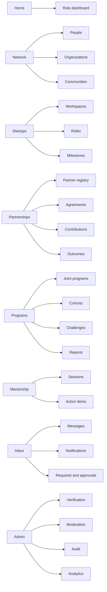
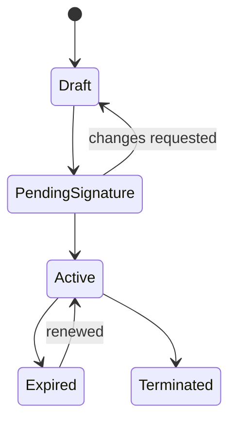
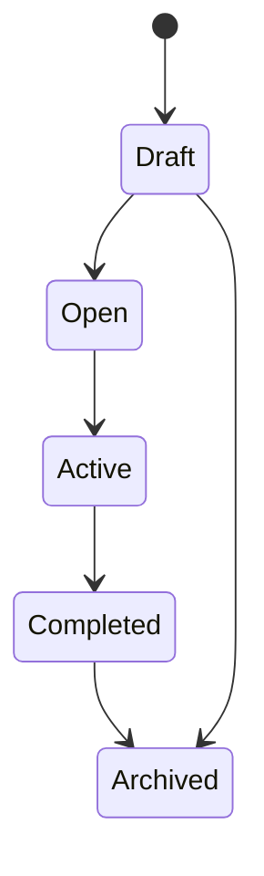
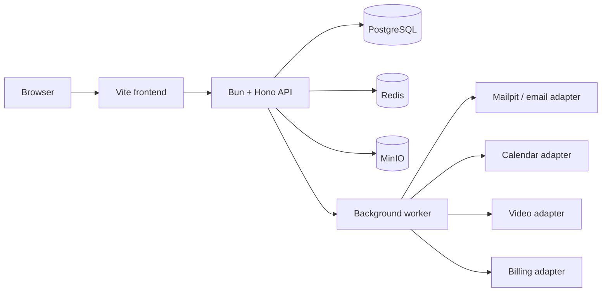

# SSC Partnership Operating System Architecture

Status: implementation baseline  
Language: English  
Primary deployment target: Docker Compose  
Product direction: partnership-first, founder workflows preserved

## 1. Product boundary

SSC is a multi-tenant partnership operating system for student entrepreneurship. It lets universities, student communities, companies, accelerators, sponsors, mentor networks, investors, and verified students run joint programs through one auditable system.

The core operating loop is:

```text
verify identity and organization
→ formalize partnership
→ launch joint program
→ recruit and form teams
→ record partner contributions
→ complete mentor and startup work
→ attach evidence
→ verify and attribute outcomes
→ export partner and program reports
```

The existing founder feed, profiles, communities, startup pages, mentorship, investor discovery, jobs, messaging, and live experience remain product capabilities. They become consumers of partnership, program, trust, and evidence data rather than isolated demo surfaces.

## 2. Information architecture



Top-level navigation is Home, Network, Startups, Partnerships, Programs, Mentorship, and Inbox. Admin is visible only to scoped program operators and platform administrators. Reputation is contextual inside profiles and dashboards rather than a popularity-first global navigation item.

## 3. Roles and tenancy

Users may hold multiple roles:

- `student`
- `founder`
- `mentor`
- `investor`
- `partner_admin`
- `program_manager`
- `moderator`
- `platform_admin`

Organization membership scopes actions to one tenant. Platform administrators operate globally. Program managers operate within delegated programs and organizations. Partner administrators can manage their organization, agreements, commitments, evidence, and reports but cannot inspect unrelated tenants.

Authorization is evaluated as:

```text
authenticated user
→ active role
→ organization membership
→ resource tenant
→ delegated program scope
→ requested action
→ step-up authentication requirement
```

## 4. Domain modules

### Identity and trust

Owns authentication, sessions, role assignments, organization memberships, student/mentor/partner verification, consent, retention, and account export/deletion.

### Organizations and partnerships

Owns organization profiles, contacts, verification, agreements, agreement parties, responsibilities, commitments, documents, renewal, and termination.

### Programs and cohorts

Owns joint programs, program partners, partner roles, cohorts, applications, participants, challenges, eligibility, milestones, events, rubrics, and program health.

### Startups and work

Owns startups, members, open roles, applications, tasks, discussions, milestones, updates, and evidence-bearing work.

### Mentorship

Owns mentor profiles, availability, matches, goal sheets, sessions, notes, action items, feedback, and impact signals.

### Investor access

Owns investor profiles, discovery permissions, watchlists, evidence views, and introduction requests.

### Contributions, evidence, and outcomes

Owns partner contributions, evidence artifacts, verification, outcome attribution, confidence, reversals, and exportable evidence timelines.

### Reputation and analytics

Owns score events, score snapshots, anti-gaming rules, activity decay, confidence bands, event taxonomy, dashboards, and reports.

### Operations

Owns inbox requests, notifications, moderation, audit logs, scheduled work, provider webhooks, and system health.

## 5. Canonical entities

All v3 client contracts use string identifiers. API-backed identifiers are UUID strings. Offline demo identifiers use stable prefixes such as `usr_`, `org_`, `agr_`, and `prg_`.

| Entity | Essential fields |
|---|---|
| User | id, username, name, email, profile, verification state |
| UserRole | userId, role, organizationId?, programId?, status |
| Organization | id, type, legal/display name, slug, verification, country, website |
| OrgMembership | organizationId, userId, title, role, permissions, status |
| PartnershipAgreement | id, type, title, status, dates, outcomes, terms, review date |
| AgreementParty | agreementId, organizationId, role, responsibilities |
| Program | id, type, status, host organization, outcomes framework, dates |
| ProgramPartner | programId, organizationId, partner role, commitment |
| Cohort | id, programId, name, dates, capacity, status |
| CohortParticipant | cohortId, userId/startupId, status, joinedAt |
| PartnerContribution | programId, organizationId, type, quantity, evidence, verification |
| EvidenceArtifact | owner, evidence type, URL/metadata, hash, verification state |
| OutcomeRecord | program/startup, outcome type, attribution, partners, confidence, evidence |
| ConsentRecord | user, purpose, policy version, granted/withdrawn timestamps |
| ScoreEvent | entity, score family, source, delta, evidence, reversal |
| AuditLog | actor, tenant, action, target, before/after metadata, timestamp |

## 6. Partnership state machines





Only active agreement parties may verify contributions for agreement-scoped programs. Completed or archived programs remain immutable except for audited outcome corrections.

## 7. API groups

All endpoints are rooted at `/api`. Mutations accept an idempotency key. Responses use a consistent `{ data, meta? }` envelope; errors use `{ error: { code, message, fieldErrors?, requestId } }`.

| Domain | Endpoints |
|---|---|
| Auth | `/auth/magic-link`, `/auth/oauth/:provider`, `/auth/passkeys`, `/auth/session` |
| Identity | `/users/me`, `/roles`, `/verifications`, `/consents`, `/privacy/export` |
| Organizations | `/organizations`, `/organizations/:id/members`, `/organizations/:id/verify` |
| Agreements | `/agreements`, `/agreements/:id/parties`, `/agreements/:id/transitions` |
| Programs | `/programs`, `/programs/:id/partners`, `/cohorts`, `/applications` |
| Work | `/startups`, `/startup-roles`, `/tasks`, `/milestones`, `/updates` |
| Mentorship | `/mentors`, `/mentor-sessions`, `/mentor-sessions/:id/actions` |
| Investors | `/investor/discovery`, `/watchlists`, `/intro-requests` |
| Evidence | `/evidence`, `/contributions`, `/outcomes`, `/outcomes/:id/verify` |
| Reputation | `/scores/:entityType/:id`, `/rankings`, `/score-events/recompute` |
| Operations | `/inbox`, `/notifications`, `/moderation`, `/audit-logs` |
| Reports | `/reports/program/:id`, `/reports/partner/:id`, `/reports/cohort/:id` |

## 8. Evidence and attribution

Evidence types include task completion, milestone proof, mentor notes, partner contribution verification, attendance, submissions, reviews, introductions, signed documents, files, and links.

Outcome attribution modes are:

- `direct`: one partner contribution was necessary and directly linked.
- `shared`: two or more partners jointly enabled the outcome.
- `influenced`: support plausibly improved the result without sole causality.
- `ambient`: ecosystem context only; excluded from attributable outcome totals.

Every verified outcome records a primary partner where applicable, supporting partners, confidence, evidence references, verifier, and audit trail. Corrections never overwrite history; they create reversal and replacement events.

## 9. Reputation engine

Separate score families are maintained for builder contribution, startup execution, mentor impact, partner impact, investor readiness, and program health.

Scoring rules:

- unverified activity has no score impact;
- self-confirmation is forbidden;
- reciprocal activity is capped and anomaly-checked;
- evidence-bearing work outweighs social engagement;
- score changes are event-sourced and reversible;
- recent execution decays while durable achievements remain visible;
- confidence and evidence counts are displayed with every score;
- only platform administrators can trigger global recomputation.

The ranking UI never represents a score as a prediction of funding or individual worth.

## 10. Analytics taxonomy

Controlled event families:

- `auth.*`
- `profile.*`
- `startup.*`
- `mentor.*`
- `program.*`
- `partner.*`
- `investor.*`
- `evidence.*`
- `outcome.*`
- `reputation.*`
- `admin.*`

Events exclude raw PII. High-value events carry organization, program, cohort, role, and evidence metadata using internal identifiers.

North-star metrics:

1. Monthly Activated Builders.
2. Partnership-Attributed Builder Outcomes.

## 11. Docker-first deployment



Docker Compose services:

- `frontend`
- `api`
- `worker`
- `postgres`
- `redis`
- `minio`
- `mailpit`

Provider adapters default to local or sandbox implementations. Missing external credentials disable only the affected integration and expose a health/status message.

## 12. Security and privacy

- Passwordless authentication with optional OAuth and WebAuthn.
- Step-up authentication for agreements, verification, billing, exports, and privileged administration.
- Tenant-scoped authorization on every resource query.
- Rate limiting, idempotency, CSRF/session protection, secure cookies, and signed webhooks.
- Explicit consent for partner sharing, messaging, analytics, and evidence visibility.
- Raw FIN values are not retained by default.
- Verification uploads use short retention, restricted access, validation, quarantine, and auditable deletion.
- Account export and erasure preserve legally required audit records in minimized form.
- WCAG 2.2 AA is the accessibility target.

## 13. Compatibility and migration

- `studentStartupCommunityDemoData.v2` is backed up before v3 conversion.
- Numeric legacy IDs are mapped to deterministic prefixed string IDs.
- Unknown or corrupt records are quarantined instead of silently discarded.
- Demo mode remains available for offline presentation.
- API mode uses the same domain contracts and query keys.
- Existing route changes use redirects where a public route is replaced.

## 14. Five-part delivery gates

1. Research, DOCX, architecture, v3 contracts, migration, and information architecture.
2. Partner registry, organizations, agreements, and demo persistence.
3. Joint programs, cohorts, contributions, role dashboards, and integrated demo journeys.
4. Backend, identity, RBAC, evidence, outcomes, scoring, audit, reports, and API cutover.
5. Provider adapters, hardening, pilot operations, QS application package, and complete validation.

Every gate requires clean lint, tests, production build, migration coverage, and a diff review. No later part may weaken an earlier gate.

## 15. AI assistant and matching foundation

The assistant now has two compatible runtimes. Offline demo mode performs deterministic
matching in the browser. API mode uses authenticated, rate-limited backend retrieval over
people, startup, role, milestone, mentor, job, program, and authorized partner records.
English, Turkish, and Azerbaijani prompts are normalized into explicit intent and criteria.

Current relevance families:

- collaborator: skills, role intent, availability, verification, and context;
- mentor: expertise, stage focus, active status, rating, and recorded sessions;
- opportunity: skills, role, location, curation, and actionability;
- venture: sector, stage, execution readiness, evidence coverage, team completeness, and activity.

Every result exposes matched signals, missing signals, component values, and a confidence
band. The result is never described as funding probability, compatibility certainty, or
investment advice. Missing fields reduce confidence and are not inferred.

Implemented backend controls:

1. authenticated `GET /assistant/capabilities`, `POST /assistant/query`, and
   `POST /assistant/feedback`;
2. investor-only `POST /investor/discovery`;
3. PostgreSQL full-text candidate retrieval followed by deterministic, explainable scoring;
4. role filtering before candidate retrieval and result construction;
5. a provider-neutral OpenAI-compatible adapter that receives only a redacted prompt and
   may extract structured intent and criteria, but never receives or selects database rows;
6. deterministic fallback on provider timeout, failure, disabled configuration, or invalid
   structured output;
7. Redis-backed per-user assistant rate limits;
8. metadata-only query records containing a one-way prompt fingerprint, structured criteria,
   result identifiers, engine, status, and latency—never the raw prompt;
9. structured feedback records and audit events without raw prompt content.

The current retrieval foundation deliberately does not use embeddings. `pgvector`, long-term
assistant memory, autonomous actions, web search, fine-tuning, and streaming are deferred
until evaluation data and privacy controls justify them.

The language model must not bypass RBAC, invent evidence, silently alter scores, or rank
people by protected characteristics. Deterministic evidence and authorization checks remain
authoritative even after semantic retrieval is added.
